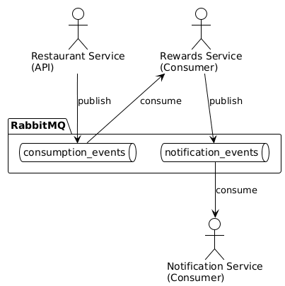
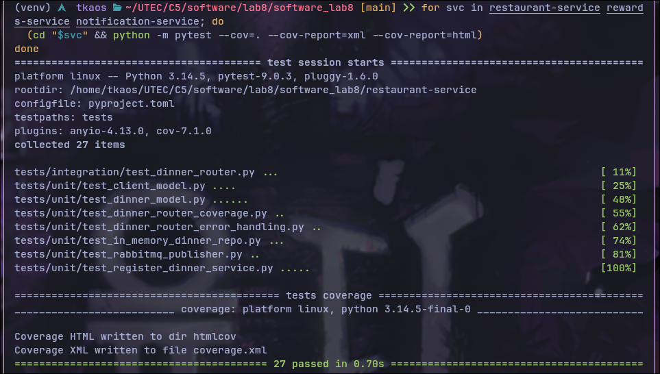
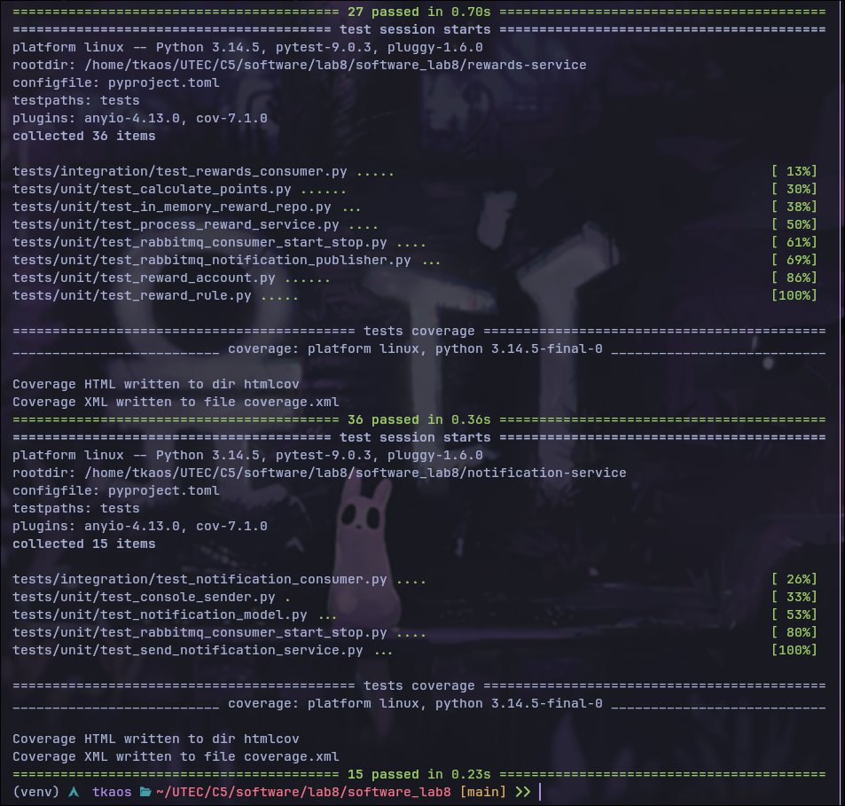
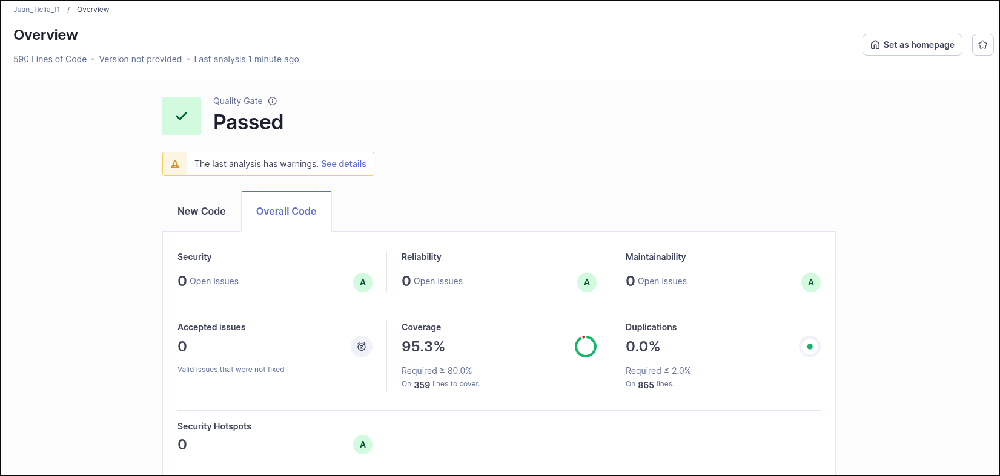
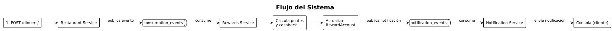

# Sistema de Recompensas - Laboratorio 8

Sistema de recompensas para restaurantes implementado con arquitectura orientada a eventos (EDA) y hexagonal (Ports & Adapters) en Python.  
Tres microservicios desacoplados se comunican asíncronamente mediante RabbitMQ para registrar consumos, calcular recompensas y notificar a los clientes.

---

## Arquitectura

### Nivel Macro: Arquitectura Orientada a Eventos (EDA)

El sistema utiliza **RabbitMQ** como broker de mensajería para desacoplar los microservicios. Cada servicio publica y consume eventos a través de colas, sin comunicación directa entre ellos.

**Colas del sistema:**
- `consumption_events` — el Restaurant Service publica eventos de cena; el Rewards Service los consume
- `notification_events` — el Rewards Service publica eventos de recompensa procesada; el Notification Service los consume



**Justificación de EDA:**
- **Desacoplamiento total** — los servicios no se conocen entre sí, solo conocen el formato del evento
- **Tolerancia a fallos** — si un servicio consumidor falla, los eventos permanecen en la cola hasta que se recupere
- **Escalabilidad independiente** — cada servicio puede escalar horizontalmente según su propia demanda sin afectar a los demás
- **Flujo asíncrono natural** — el procesamiento de recompensas no necesita ser instantáneo; el cliente recibe la notificación cuando el sistema completa el proceso

### Nivel Micro: Arquitectura Hexagonal (Ports & Adapters)

Cada servicio separa la lógica de negocio (dominio) de los detalles técnicos mediante **puertos** (interfaces abstractas) y **adaptadores** (implementaciones concretas).

| Capa | Contenido |
|------|-----------|
| **models/** | Entidades/value objects del dominio (Dinner, RewardAccount, Notification, RewardRule) |
| **services/** | Casos de uso — orquestan la lógica de negocio pura |
| **ports/** | Contratos/interfaces abstractas para comunicación externa |
| **adapters/** | Implementaciones concretas de los puertos (RabbitMQ, APIs, repos en memoria) |

**Inbound adapters** (cómo llegan los datos al dominio):
- API REST (`adapters/api/`) — Restaurant Service
- RabbitMQ consumers (`adapters/rabbitmq/`) — Rewards & Notification Services

**Outbound adapters** (cómo el dominio se comunica con el exterior):
- RabbitMQ publishers (`adapters/rabbitmq/`) — publicación de eventos
- Repositorios en memoria (`adapters/repositories/`) — persistencia temporal
- Console sender (`adapters/senders/`) — envío de notificaciones por consola

**Justificación de Hexagonal:**
- **Dominio puro** — la lógica de negocio no tiene dependencias de infraestructura (bases de datos, brokers, frameworks web), lo que la hace fácil de entender y modificar
- **Testeabilidad** — los puertos se pueden mockear fácilmente; las pruebas unitarias validan la lógica de negocio sin necesidad de levantar infraestructura real
- **Flexibilidad tecnológica** — cambiar de RabbitMQ a Kafka, o de repositorios en memoria a PostgreSQL, solo implica escribir un nuevo adaptador sin tocar el dominio
- **Mantenibilidad** — cada adaptador tiene una responsabilidad única y está aislado del resto

### Diagrama de Casos de Uso


---

## Evidencia de Pruebas y Calidad

### Tests





### SonarQube



---

## Estructura del Proyecto

```
software_lab8/
├── restaurant-service/                # API REST para registro de cenas
│   ├── models/
│   │   ├── dinner.py                  # Entidad Dinner
│   │   └── client.py                  # Value Object Client
│   ├── services/
│   │   └── register_dinner.py         # Caso de uso: registrar cena
│   ├── ports/
│   │   ├── event_publisher.py         # Puerto de salida para eventos
│   │   └── dinner_repository.py       # Puerto de salida para persistencia
│   ├── adapters/
│   │   ├── api/dinner_router.py       # Adaptador de entrada: API REST
│   │   ├── rabbitmq/
│   │   │   └── rabbitmq_publisher.py  # Adaptador de salida: RabbitMQ
│   │   └── repositories/
│   │       └── in_memory_dinner_repo.py # Adaptador de salida: repositorio en memoria
│   ├── tests/
│   │   ├── unit/
│   │   └── integration/
│   ├── main.py                        # Entry point FastAPI
│   ├── Dockerfile
│   ├── pyproject.toml
│   └── requirements.txt
├── rewards-service/                   # Consumidor de eventos, calcula recompensas
│   ├── models/
│   │   ├── reward_account.py          # Entidad cuenta de recompensas
│   │   └── reward_rule.py             # Value Object regla de cálculo
│   ├── services/
│   │   ├── process_reward.py          # Caso de uso orquestador
│   │   ├── calculate_points.py        # Servicio de cálculo de puntos
│   │   └── calculate_cashback.py      # Servicio de cálculo de cashback
│   ├── ports/
│   │   ├── reward_repository.py       # Puerto de salida para persistencia
│   │   └── notification_publisher.py  # Puerto de salida para notificaciones
│   ├── adapters/
│   │   ├── rabbitmq/
│   │   │   └── rabbitmq_consumer.py   # Adaptador de entrada: RabbitMQ consumer
│   │   └── repositories/
│   │       ├── in_memory_reward_repo.py      # Repositorio en memoria
│   │       └── rabbitmq_notification_publisher.py # Adaptador de salida: RabbitMQ
│   ├── tests/
│   │   ├── unit/
│   │   └── integration/
│   ├── main.py                        # Entry point del consumer
│   ├── Dockerfile
│   ├── pyproject.toml
│   └── requirements.txt
├── notification-service/              # Consumidor de eventos, envía notificaciones
│   ├── models/
│   │   └── notification.py            # Entidad Notification
│   ├── services/
│   │   └── send_notification.py       # Caso de uso: enviar notificación
│   ├── ports/
│   │   └── notification_sender.py     # Puerto de salida para envío
│   ├── adapters/
│   │   ├── rabbitmq/
│   │   │   └── rabbitmq_consumer.py   # Adaptador de entrada: RabbitMQ consumer
│   │   └── senders/
│   │       └── console_sender.py      # Adaptador de salida: notificación por consola
│   ├── tests/
│   │   ├── unit/
│   │   └── integration/
│   ├── main.py                        # Entry point del consumer
│   ├── Dockerfile
│   ├── pyproject.toml
│   └── requirements.txt
├── shared/                            # Módulo compartido
│   ├── events/
│   │   └── consumption_event.py   # Evento de dominio: ConsumptionEvent
│   └── messaging/
│       ├── consumer.py            # Puerto abstracto AbstractConsumer
│       └── publisher.py           # Puerto abstracto AbstractPublisher
├── docker/
├── docker-compose.yml
├── sonar-project.properties
└── .gitignore
```

---

## Flujo del Sistema



### Evento de Consumo (formato JSON)

```json
{
  "event_id": "uuid",
  "amount": 150.0,
  "card_number": "1234567890",
  "restaurant_code": "REST-01",
  "timestamp": "2025-05-25T12:00:00"
}
```

---

## Requisitos Técnicos

| Requisito | Versión |
|-----------|---------|
| **Python** | ≥ 3.11 |
| **RabbitMQ** | 3.12+ |
| **FastAPI** | ≥ 0.110 |
| **Pika** | ≥ 1.3.2 |
| **Pytest** | ≥ 8.1 |
| **Docker** | cualquier |

---

## Ejecución

### Con Docker Compose (Recomendado)

```bash
docker compose up -d
```

Esto inicia:
- RabbitMQ (gestión en http://localhost:15672)
- Restaurant Service (http://localhost:8001)
- Rewards Service
- Notification Service

### Localmente

1. Iniciar RabbitMQ:
```bash
docker run -d -p 5672:5672 -p 15672:15672 rabbitmq:3.12-management
```

2. Instalar dependencias:
```bash
cd shared && pip install -e . && cd ..
for svc in restaurant-service rewards-service notification-service; do
  cd $svc && pip install -r requirements.txt && cd ..
done
```

3. Ejecutar servicios (tres terminales):
```bash
# Terminal 1 - Restaurant Service (API: http://localhost:8001)
cd restaurant-service && python main.py

# Terminal 2 - Rewards Service
cd rewards-service && python main.py

# Terminal 3 - Notification Service
cd notification-service && python main.py
```

### Pruebas

Por servicio:
```bash
cd restaurant-service && pytest --cov=. --cov-report=xml --cov-report=html
cd rewards-service    && pytest --cov=. --cov-report=xml --cov-report=html
cd notification-service && pytest --cov=. --cov-report=xml --cov-report=html
```

O desde la raíz:
```bash
for svc in restaurant-service rewards-service notification-service; do
  (cd $svc && pytest --cov=. --cov-report=xml --cov-report=html)
done
```

---

## API Endpoints (Restaurant Service)

| Método | Ruta | Descripción |
|--------|------|-------------|
| POST | `/dinners/` | Registrar una nueva cena |
| GET | `/health` | Health check del servicio |

### Ejemplo: `POST /dinners/`

```bash
curl -X POST http://localhost:8001/dinners/ \
  -H "Content-Type: application/json" \
  -d '{"amount": 100.0, "card_number": "1234567890", "restaurant_code": "REST-01"}'
```

Respuesta:
```json
{
  "dinner_id": "uuid",
  "amount": 100.0,
  "card_number": "1234567890",
  "restaurant_code": "REST-01",
  "timestamp": "2025-05-25T12:00:00"
}
```

---

## Principios de Diseño Aplicados

| Principio | Cómo se aplica |
|-----------|----------------|
| **Alta cohesión** | Cada servicio y cada módulo tiene una responsabilidad única y bien definida |
| **Bajo acoplamiento** | Los servicios se comunican exclusivamente mediante eventos asíncronos vía RabbitMQ |
| **Modularidad** | Separación clara en capas (models, services, ports, adapters) dentro de cada servicio |
| **Abstracción** | Puertos (interfaces ABC) definen contratos; los adaptadores implementan los detalles concretos |
| **Escalabilidad** | Cada servicio puede escalar de forma independiente gracias al broker de eventos |
| **Arquitectura Hexagonal** | El dominio (models + services) no depende de infraestructura externa |
| **Event-Driven** | El flujo completo se orquesta mediante eventos publicados y consumidos asíncronamente |
